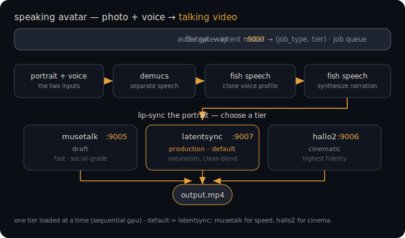

# 🎙️ Mushishi Audio Stack

**A fully local, self-hosted audio AI pipeline: voice cloning, TTS, lip-sync avatars, music generation, and auto-dubbing — on one RTX 5090.**

Every model is MIT or Apache-2.0 licensed. No audio ever leaves the machine. Built as a companion to the [Mushishi Sovereign AI Stack](https://github.com/MushiSenpai/mushishi-sovereign-ai-stack).

---

## How this was built (read this first)

I don't hand-write code. Every script, worker, and compose file in this repo was written by LLMs (Claude primarily; idea-stage input from Gemini, Grok, and Kimi) under my direction. My work is everything around the code: architecture and tool selection, the specs the LLMs execute against (spec-driven development with snapshot/verify gates), debugging direction, verification, and day-2 operations. I have a B.E. in Computer Science — I read code fluently; I direct rather than write it. This repo is both the artifact and the evidence that the method works. The install deviated from the original spec in **25+ places** — all documented in [LESSONS.md](LESSONS.md), because the failures are more useful than the successes.

---

## What it does

| Capability | Models | Quality tiers |
|---|---|---|
| **Speaking avatar** from a photo + voice sample | MuseTalk → LatentSync → Hallo2 | draft / production / cinematic |
| **Voice cloning + TTS** | Fish Speech 1.5 (+ Demucs sample cleaning) | fast / full |
| **Music generation** (full songs with vocals) | YuE 7B, ACE-Step 3.5B, Stable Audio Open | draft / production / song |
| **Transcription** with word-level timestamps | Whisper Large V3 Turbo + WhisperX | draft / production |
| **Auto-dubbing** into another language | WhisperX → local LLM translation → Fish Speech → FFmpeg | video-locked / audio-first |

## Architecture

```
                    ┌──────────────────────────────────────┐
 client ──HTTP──►   │  Audio Gateway API (:9000, FastAPI)  │
                    │  intent router → (job_type, tier)    │
                    └────────────┬─────────────────────────┘
                                 │ enqueue
                    ┌────────────▼─────────────┐
                    │  Redis + RQ job queues   │◄── rq-dashboard (:9010)
                    └────────────┬─────────────┘
                                 │ consume
                    ┌────────────▼─────────────────────────┐
                    │  audio-worker (GPU container)        │
                    │  stt.py · voice.py · lipsync.py ·    │
                    │  music.py · dub.py                   │
                    └──────┬───────────┬───────────────────┘
                           │           │
                  Fish Speech (:9002)  └─► outputs/ (mp4 / wav / mp3 / srt)
```

**Why a job queue:** audio jobs run 10 seconds to 15 minutes. The gateway only enqueues; a separate GPU worker container consumes. Async submission, status polling, orderly VRAM access, live monitoring — and a one-line scale path.

**VRAM discipline:** the RTX 5090's 32GB is shared with an LLM stack and a diffusion stack. Audio runs in defined modes (light ~10GB / full ~16GB / music-exclusive ~16GB) with mode scripts that stop conflicting services first. See the [full spec](docs/mushishi-audio-stack-v1.0.1.md) for the handoff protocol.

## The avatar pipeline (end-to-end)

<p align="center"></p>

```
portrait.jpg + voice_sample.wav
  → Demucs        (separate speech from background noise/music)
  → Fish Speech   (create reusable cloned voice profile)
  → Fish Speech   (synthesize narration in the cloned voice)
  → LatentSync    (lip-sync the portrait to the narration)
  → output MP4
```

Submit it as one job:

```bash
curl -X POST http://localhost:9000/audio/job \
  -F "job_type=lipsync" -F "quality=production" \
  -F "text=Your narration text here" \
  -F "source_file=@portrait.jpg" \
  -F "voice_ref=@voice_sample.wav"
# → {"job_id": "...", "status": "queued"}
curl http://localhost:9000/audio/status/<job_id>
```

## Hardware & requirements

- RTX 5090 32GB (Blackwell SM_120 — this drives several non-obvious choices, e.g. PyTorch nightly cu130, SDPA instead of flash-attn; see LESSONS.md)
- Ubuntu 24.04 · CUDA 12.8+ base images · Docker + NVIDIA Container Toolkit
- ~60GB disk for model weights

## Repo layout

```
docs/        full spec (architecture, VRAM modes, build order, troubleshooting)
gateway/     FastAPI gateway + intent router + RQ workers (the actual running code)
compose/     docker-compose.yml + shared Dockerfile (as-built, not as-planned)
scripts/     mode-switch scripts (audio-mode / audio-stop / music-mode)
LESSONS.md   25+ hard-won fixes — read before installing anything
benchmarks/  measurements (updated weekly)
```

## Honest status

Built and verified end-to-end (all five pipelines produce output; avatar and dubbing confirmed on real inputs). Quality benchmarking against client-grade standards is **in progress** — results land in `benchmarks/` as they're measured, including failures. Mono-only YuE output and lipsync drift limits are documented, not hidden.

## License

MIT. Model weights have their own licenses (all MIT/Apache-2.0 — chosen deliberately; MusicGen was excluded for its non-commercial license).
